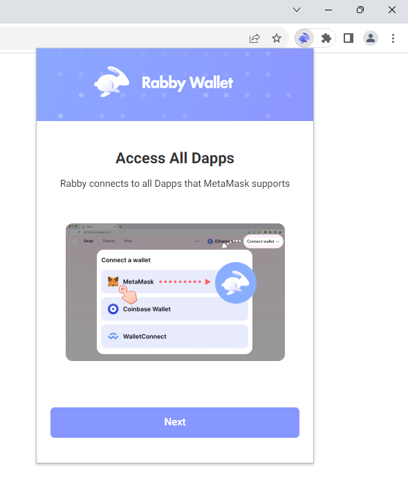
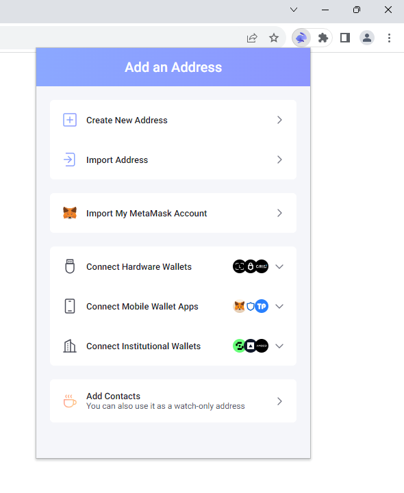
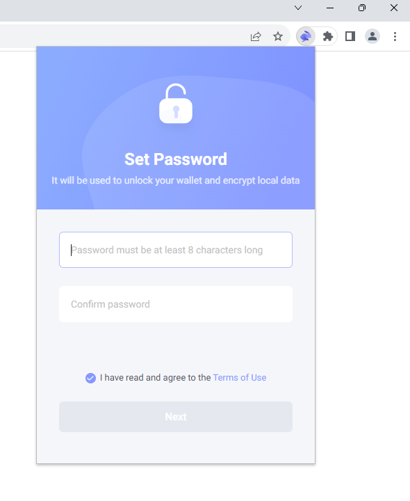
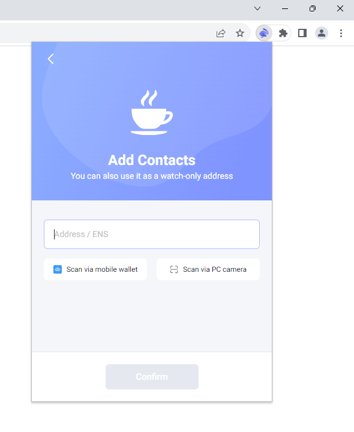
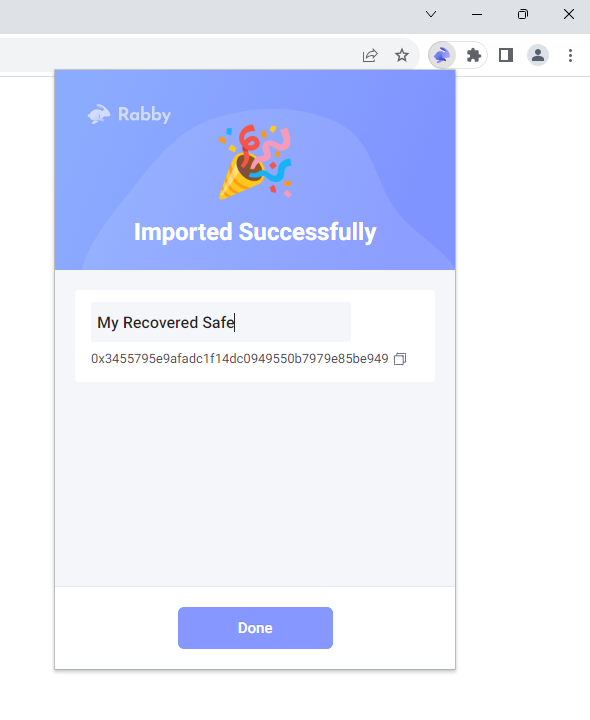
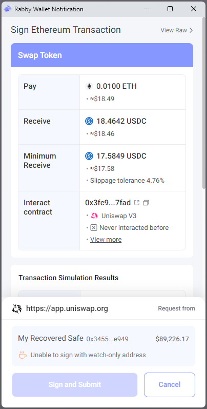
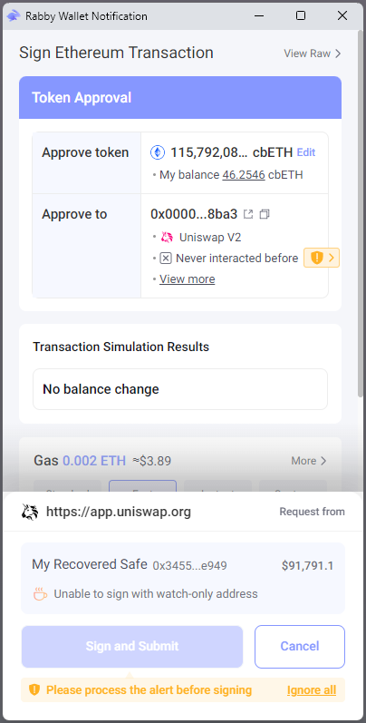
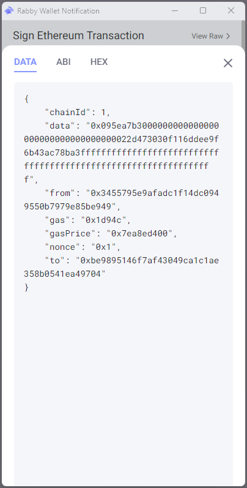
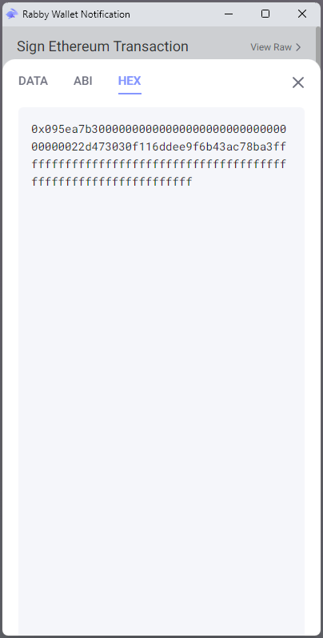

# Waymont Vaults Global Recovery Script

Recovery script for use in the event that Waymont's transaction policy guardian (or other critical off-chain infrastructure) malfunctions.

## Instructions

### Export Private Key

First, export your 12-word mnemonic seed phrase (root private key) and your vault subkey indexes from your Waymont mobile signer app:

1. Open the Waymont mobile app on your mobile app.
2. Tap the Waymont bull logo at the top of the screen 3 times.
3. A "Developer Mode" popup will open asking you to "Enter the password". Type in the password "WaymontVIP".
4. Hit "Export Private Key" near the bottom of the menu.
5. Confirm that you are aware of the security implications of exporting your root private key.
6. Authenticate using biometrics.
7. The app will display your unencrypted root private key in the form of a 12-word mneumonic seed phrase.
    - **WARNING: Do NOT attempt to transmit this sensitive private key to your computer electronically--simply MANUALLY type it directly into the recovery script (described below) on your computer.**
8. Take note of your vault subkey indexes as well.
    - While they do not need to be private, these are necessary to recover your vaults using this script (as they provide the paths to derive the keys for each vault from your root key).

*As with many other self-custody providers, your 12-word mnemonic seed phrase is the root private key of a HD (hierarchical deterministic) tree of signers for each Waymont vault you own or are a guardian on. However, Waymont does not ask users to manually back it up as it should only be needed in the case of emergency recovery from the policy guardian as described in this document.*

### Command Line Prerequisites

1. [Download and install Node.js](https://nodejs.org/en/download/) or [install Node.js via a package manager](https://nodejs.org/en/download/package-manager/) (we prefer [`nvm`--Node Version Manager](https://github.com/nvm-sh/nvm#install--update-script)).
    - The script has been tested with Node.js version `v18.16.0`.
2. **WARNING: Before running the scripts, run the following command to disable bash (command line) history so your unencrypted seed phrase is NOT saved to disk: `set +o history`**

### Recover Each Vault Address Individually

On your computer, for each Waymont vault address you would like to export:

#### Identify Vault Subkey Index

Using the list of vault subkey indexes found in or exported from the Waymont mobile signer app ([as described above](#export-private-key)), identify the vault subkey index corresponding to the Waymont vault address you are looking to recover.

#### Initiate Vault Recovery if Necessary

Note that if Waymont has globally disabled the relay guardian/transaction policy engine on all vaults (as a result of the business shutting down, for example), you do not need to run the vault recovery initiation script and wait for the 14-day timelock to pass--you can go straight to running the execution script.

Run the following commands to intiate vault recovery:

```
git clone https://github.com/pentagonxyz/waymont-vaults-global-recovery-script
cd waymont-vaults-global-recovery-script
npm run initiate-recovery http://localhost:8545 0xYOURWALLETCONTRACTADDRESSHERE YOURVAULTSUBKEYINDEX 0xFUNDEDPRIVATEKEYFORGAS "type your mnemonic phrase here"
```

- Replace `http://localhost:8545` with your Web3 provider's JSON-RPC API endpoint URL--for example: `https://mainnet.infura.io/v3/YOUR-API-KEY`.
- Replace `0xYOURVAULTSAFECONTRACTADDRESSHERE` with your Waymont vault (`Safe` smart contract) address.
- Replace `YOURVAULTSUBKEYINDEX` with the vault subkey index integer you found [in the steps above](#export-private-key).
- Replace `0xFUNDEDPRIVATEKEYFORGAS` with an Ethereum account's private key with enough Ethereum for the gas costs necessary to send the transactions you would like to send.
- Replace `type your mnemonic phrase here` with your mnemonic seed phrase.

Assuming that the initiation script passed with a transaction hash, you should wait for the 14-day timelock to pass before executing wallet recovery.

#### Execute Vault Recovery

If necessary, wait for the 14-day timelock to pass; then, run the following commands to complete recovery of your wallet:

```
npm run execute-recovery http://localhost:8545 0xYOURVAULTSAFECONTRACTADDRESSHERE YOURVAULTSUBKEYINDEX 0xFUNDEDPRIVATEKEYFORGAS "type your mnemonic phrase here"
```

In the event of failure, the execution script will also tell you how long you have left to wait.

#### Using Your Recovered `Safe`

```
npm run execute-safe-transactions http://localhost:8545 0xYOURVAULTSAFECONTRACTADDRESSHERE YOURVAULTSUBKEYINDEX 0xFUNDEDPRIVATEKEYFORGAS "type your mnemonic phrase here" 0xEXAMPLECALL1TARGET 0xEXAMPLECALL1DATA EXAMPLECALL1VALUE 0xEXAMPLECALL2TARGET 0xEXAMPLECALL2DATA EXAMPLECALL2VALUE
```

- Replace `0xEXAMPLECALL1TARGET 0xEXAMPLECALL1DATA EXAMPLECALL1VALUE 0xEXAMPLECALL2TARGET 0xEXAMPLECALL2DATA EXAMPLECALL2VALUE` with the following values, all separated by spaces: for each transaction you want to send, enter the target address, data to be sent to the target, and ETH value to be sent to the target.
    - If you are simply trying to send ETH to a target without any contract function call data, just use "0x" for the data parameter.

##### Using Rabby to Get Function Call Data

Rabby's watch-only addresses feature can make the process of getting the function call data you need to use your recovered Safe easier:

1. Download Rabby from the Chrome Web Store at the following link: [https://chrome.google.com/webstore/detail/rabby-wallet/acmacodkjbdgmoleebolmdjonilkdbch](https://chrome.google.com/webstore/detail/rabby-wallet/acmacodkjbdgmoleebolmdjonilkdbch)
2. If opening Rabby for the first time, click "Next" on the first screen and then "Get Started" on the next screen.
    
3. On the "Add an Address" screen, click "Add Contacts" at the bottom.
    
4. On the "Set Password" screen, set a password. Note that you will not be protecting any private keys with this password in this tutorial--only your Safe address.
    
5. On the "Add Contacts" screen, enter your recovered Waymont Safe address and click "Confirm."
    
6. On the "Imported Successfully" screen, enter a name (if you would like) and click "Done."
    
7. You should now be able to simulate transactions from your Safe via Rabby (in order to get the function call data you need). Use Rabby just like you would MetaMask (choose to connect to MetaMask in dApps to get them to connect to Rabby and use the dApp to initate transactions).
    - For normal transactions (as opposed to approvals), to get the destination address of a simulated transaction, simply hover over the address listed to the right of "Interact contract" and click the copy button that appears on hover. As an example, the screenshot below shows a transaction simulation of swapping ETH via Uniswap (generated from the Uniswap dApp).

        
    - On the other hand, for approval transactions (an example of which you can see in the first screenshot below), the destination address cannot be found on the first screen--instead, you will have to click "View raw" and (as shown in the second screenshot below) copy the address listed in quotes to the right of `"to":` at the bottom of the JSON code block to find it.

        
        
    - To get the function call data for either a normal transaction or an approval transaction, click "View Raw" in the upper-right corner of the transaction simulation and then click on the "HEX" tab to copy the transaction function call data. The screenshots below show the results both of these steps in order:

        
        
